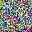

# Diffusion_Model
This repository contains a ground-up implementation of Noising-Denoising Diffusion Models (NDDMs) using a UNet model. Noising-Denoising Diffusion Models are powerful generative models designed for generating and denoising data affected by noise.

  

## Features:

UNet Architecture: The core of the code is built upon a UNet structure specifically tailored to the requirements of Noising-Denoising Diffusion Models. This architecture enables efficient representation and processing of complex data structures.

Extension with Classifier-Free Guidance: Going beyond the standard implementation, the project introduces an extension incorporating "Classifier-Free Guidance." This enhancement facilitates improved control over the denoising process without the need for additional classifiers.

## Applications:

Image reconstruction
Noise reduction in images
Generative data modeling
